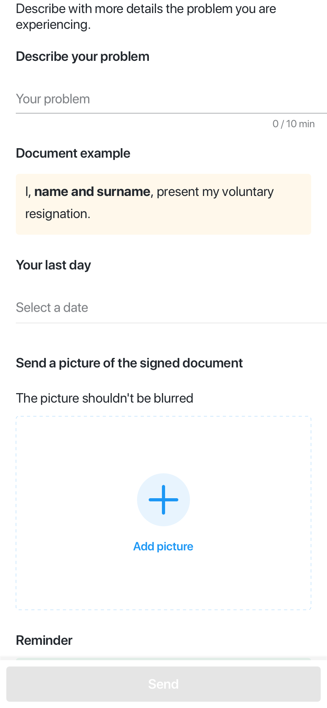
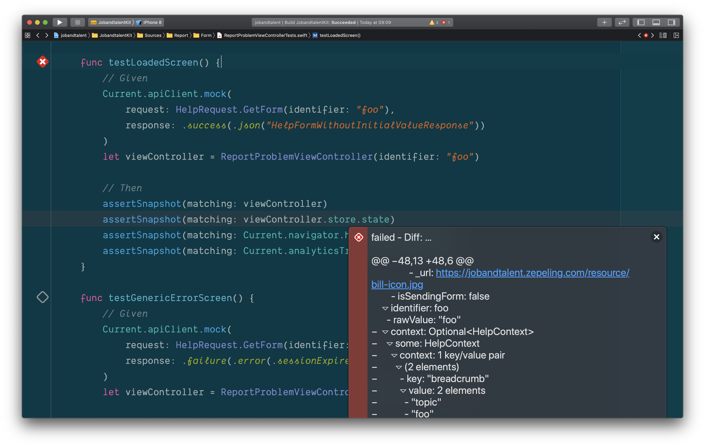
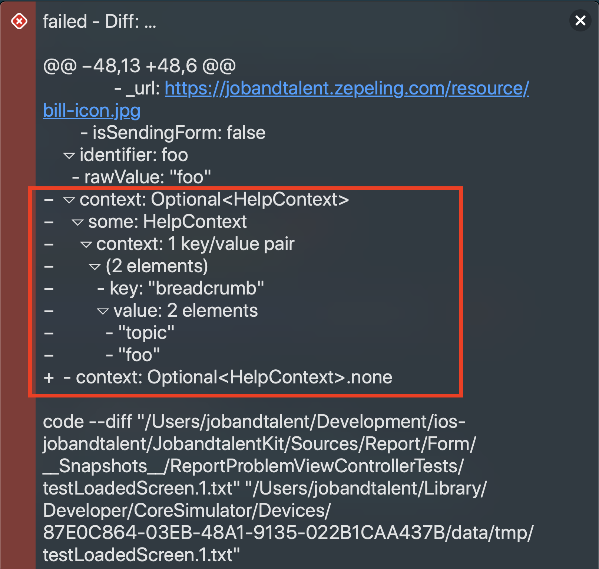
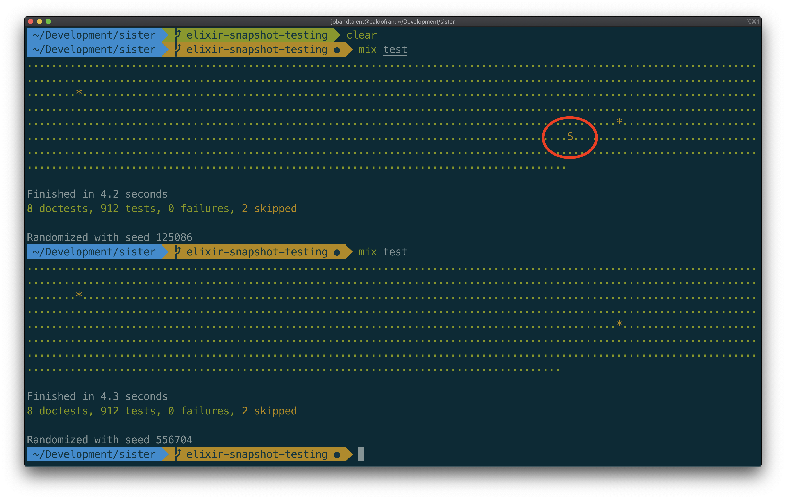
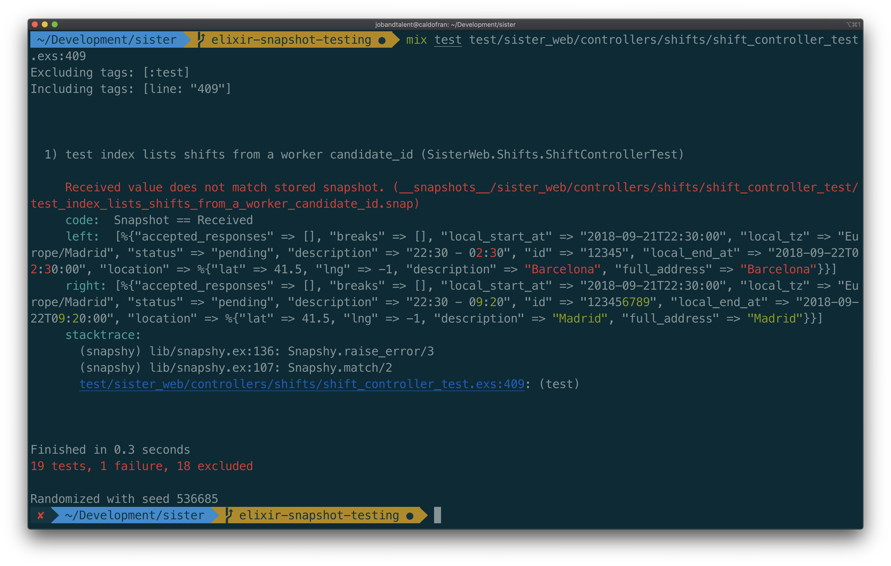

# Snapshot testing on Sister

---

# What is it?

A typical snapshot test case, takes a snapshot, then compares it to a reference snapshot file stored alongside the test.

---

# An exampe (Swift)

```swift
func testLoadedScreen() {
    // Given
    Current.apiClient.mock(
        request: HelpRequest.GetForm(identifier: "foo"),
        response: .success(.json("HelpFormWithoutInitialValueResponse"))
    )
    let sut = ReportProblemViewController(identifier: "foo")

    // Then
    assertSnapshot(matching: sut)
    assertSnapshot(matching: sut.store.state)
}
```

---

# UI snapshot

[.code-highlight: 10]

```swift
func testLoadedScreen() {
    // Given
    Current.apiClient.mock(
        request: HelpRequest.GetForm(identifier: "foo"),
        response: .success(.json("HelpFormWithoutInitialValueResponse"))
    )
    let sut = ReportProblemViewController(identifier: "foo")

    // Then
    assertSnapshot(matching: sut)
    assertSnapshot(matching: sut.store.state)
}
```



---

# State snapshot

[.column]

[.code-highlight: 11]

```swift
func testLoadedScreen() {
    // Given
    Current.apiClient.mock(
        request: HelpRequest.GetForm(identifier: "foo"),
        response: .success(.json("HelpFormWithoutInitialValueResponse"))
    )
    let sut = ReportProblemViewController(identifier: "foo")

    // Then
    assertSnapshot(matching: sut)
    assertSnapshot(matching: sut.store.state)
}
```

[.column]

```
▿ ReportProblemViewState
  ▿ loadingState: LoadingState<FormViewState, FormViewStateError>
    ▿ loaded: FormViewState
      - title: "Problem details"
      ▿ summary: Optional<String>
        - some: "Describe with more details the problem you are experiencing."
      ▿ fieldsState: 6 elements
        ▿ FieldState
          - header: "Describe your problem"
        ▿ FieldState
          ▿ textInput: TextInputState
            ▿ identifier: description
              - rawValue: "description"
            - placeholder: "Your problem"
            ▿ validation: AnimatedTextInputValidation
              ▿ both: ClosedRange(10...320)
                - lowerBound: 10
                - upperBound: 320
            - text: Optional<String>.none
            - error: Optional<String>.none
        ▿ FieldState
          - header: "Document example"
        ▿ FieldState
          - sampleText: "I, <b>name and surname</b>, present my voluntary resignation."
        ▿ FieldState
          - header: "Your last day"
        ▿ FieldState
          ▿ dateInput: DateInputState
            ▿ identifier: last-day-date
              - rawValue: "last-day-date"
            - placeholder: "Select a date"
            - date: Optional<Date>.none
      - isSendingForm: false

```

---

# A typical snapshot test case:

1. Creates the reference snapshot file stored alongside the test
2. Takes a snapshot
3. Compares it to the reference snapshot
4. The test will fail if the two snapshots do not match:

- either the change is unexpected
- or the reference snapshot needs to be updated to the new version of the UI component or state.

---



---



---

# Snapshot testing on Sister (Elixir)

---

# Before snapshot testing

```elixir
test "lists shifts from a worker candidate_id", %{conn: conn} do
      conn =
        get(
          conn,
          Routes.shift_path(conn, :index,
            job_id: "wrk_candidate_id:some-id",
            auth_token: "valid-worker"
          )
        )

      response = json_response(conn, 200)
      assert_schema("worker/shifts/list_response.json", response)

      [shift] = response["data"]
      assert "12345" == shift["id"]
      assert "22:30 - 02:30" == shift["description"]
      assert "2018-09-21T22:30:00" == shift["local_start_at"]
      assert "2018-09-22T02:30:00" == shift["local_end_at"]
      assert "Europe/Madrid" == shift["local_tz"]
      assert [] == shift["breaks"]
      refute Map.has_key?(shift, "breaks_scheme")
      assert "pending" == shift["status"]

      assert [] = shift["accepted_responses"]

      location = shift["location"]
      assert "Barcelona" == location["full_address"]
      assert "Barcelona" == location["description"]
      assert 41.5 == location["lat"]
      assert -1.0 == location["lng"]
end
```

---

# Asserting the controller output

[.code-highlight: 14-32]

```elixir
test "lists shifts from a worker candidate_id", %{conn: conn} do
      conn =
        get(
          conn,
          Routes.shift_path(conn, :index,
            job_id: "wrk_candidate_id:some-id",
            auth_token: "valid-worker"
          )
        )

      response = json_response(conn, 200)
      assert_schema("worker/shifts/list_response.json", response)

      [shift] = response["data"]
      assert "12345" == shift["id"]
      assert "22:30 - 02:30" == shift["description"]
      assert "2018-09-21T22:30:00" == shift["local_start_at"]
      assert "2018-09-22T02:30:00" == shift["local_end_at"]
      assert "Europe/Madrid" == shift["local_tz"]
      assert [] == shift["breaks"]
      refute Map.has_key?(shift, "breaks_scheme")
      assert "pending" == shift["status"]

      assert [] = shift["accepted_responses"]

      location = shift["location"]
      assert "Barcelona" == location["full_address"]
      assert "Barcelona" == location["description"]
      assert 41.5 == location["lat"]
      assert -1.0 == location["lng"]
end
```

---

# With snapshot testing

```elixir
test "lists shifts from a worker candidate_id", %{conn: conn} do
      conn =
        get(
          conn,
          Routes.shift_path(conn, :index,
            job_id: "wrk_candidate_id:some-id",
            auth_token: "valid-worker"
          )
        )

      response = json_response(conn, 200)
      assert_schema("worker/shifts/list_response.json", response)
      match_snapshot response["data"]
end
```

---

# The assertion

[.code-highlight: 13]

```elixir
test "lists shifts from a worker candidate_id", %{conn: conn} do
      conn =
        get(
          conn,
          Routes.shift_path(conn, :index,
            job_id: "wrk_candidate_id:some-id",
            auth_token: "valid-worker"
          )
        )

      response = json_response(conn, 200)
      assert_schema("worker/shifts/list_response.json", response)
      match_snapshot response["data"]
end
```

---

# Running the tests



---

# The output file

#### `test_index_lists_shifts_from_a_worker_candidate_id.snap`

```elixir
[
  %{
    "accepted_responses" => [],
    "breaks" => [],
    "description" => "22:30 - 02:30",
    "id" => "12345",
    "local_end_at" => "2018-09-22T02:30:00",
    "local_start_at" => "2018-09-21T22:30:00",
    "local_tz" => "Europe/Madrid",
    "location" => %{
      "description" => "Barcelona",
      "full_address" => "Barcelona",
      "lat" => 41.5,
      "lng" => -1
    },
    "status" => "pending"
  }
]
```

---

# Failing test



---

[.column]

# Traditional

```elixir


[shift] = response["data"]
assert "12345" == shift["id"]
assert "22:30 - 02:30" == shift["description"]
assert "2018-09-21T22:30:00" == shift["local_start_at"]
assert "2018-09-22T02:30:00" == shift["local_end_at"]
assert "Europe/Madrid" == shift["local_tz"]
assert [] == shift["breaks"]
refute Map.has_key?(shift, "breaks_scheme")
assert "pending" == shift["status"]

assert [] = shift["accepted_responses"]

location = shift["location"]
assert "Barcelona" == location["full_address"]
assert "Barcelona" == location["description"]
assert 41.5 == location["lat"]
assert -1.0 == location["lng"]

```

[.column]

# Snapshot

```elixir
[
  %{
    "accepted_responses" => [],
    "breaks" => [],
    "description" => "22:30 - 02:30",
    "id" => "12345",
    "local_end_at" => "2018-09-22T02:30:00",
    "local_start_at" => "2018-09-21T22:30:00",
    "local_tz" => "Europe/Madrid",
    "location" => %{
      "description" => "Barcelona",
      "full_address" => "Barcelona",
      "lat" => 41.5,
      "lng" => -1
    },
    "status" => "pending"
  }
]
```

---

# Advantages

- Easy to create
- Simpler and less noisy assertion
- **Broader coverage with very little effort**

---

# Disadvantages

- The assertion is not in the test
- Any change in the output, the snapshot must be regenerated
- Not TDD
- Could slow down the suite test
- Few libraries in Elixir ecosystem:
  - [Snapshy](https://github.com/DCzajkowski/snapshy), [response_snapshot](https://github.com/sb8244/elixir_response_snapshot)

---

# Ruby

- [Approvals](https://github.com/kytrinyx/approvals)
- [rspec-snapshot](https://github.com/yesmeck/rspec-snapshot)

---

# Why in Sister

---

# Simpler integration tests

## `modules + controllers + views + translations + assets`

---

### Actually testing view state

[.column]


[.column]

```json
{
  "data": {
    "id": "bar",
    "type": "form",
    "title": "Problem details",
    "summary": "Describe with more details the problem you are experiencing.",
    "items": [
      {
        "type": "section-title",
        "label": "Describe your problem"
      },
      {
        "type": "text-area",
        "label": "Your problem",
        "param_name": "description"
      },
      {
        "type": "text-area",
        "label": "Something else",
        "param_name": "additional",
        "validations": {
          "min_length": 20,
          "max_length": 255
        },
        "initial_value": "I have nothing else to add"
      }
    ],
    "context": [
      ["breadcrumb[]", "topic"],
      ["breadcrumb[]", "foo"]
    ]
  }
}
```

---

# More secure

### Broader coverage

---

# Schema tests are not enough

[.code-highlight: 12]

```elixir
test "lists shifts from a worker candidate_id", %{conn: conn} do
      conn =
        get(
          conn,
          Routes.shift_path(conn, :index,
            job_id: "wrk_candidate_id:some-id",
            auth_token: "valid-worker"
          )
        )

      response = json_response(conn, 200)
      assert_schema("worker/shifts/list_response.json", response)
      match_snapshot response["data"]
end
```

---

This is valid schema

```elixir
[
  %{
    "accepted_responses" => [],
    "breaks" => [],
    "description" => "22:30 - 02:30",
    "id" => "12345",
    "local_end_at" => "2018-09-22T02:30:00",
    "local_start_at" => "2018-09-21T22:30:00",
    "local_tz" => "Europe/Madrid",
    "location" => %{
      "description" => "Barcelona",
      "full_address" => "Barcelona",
      "lat" => 41.5,
      "lng" => -1
    },
    "status" => "pending"
  }
]
```

---

This one is valid too

```elixir
[
  %{
    "accepted_responses" => [],
    "breaks" => [],
    "description" => "22:30 - 02:30",
    "id" => "12345",
    "local_end_at" => "2018-09-22T02:30:00",
    "local_start_at" => "2018-09-21T22:30:00",
    "local_tz" => "Europe/Madrid",
    "location" => %{
      "description" => "Barcelona",
      "full_address" => "Barcelona",
      "lat" => 41.5,
      "lng" => -1
    },
    "status" => "pending"
  },
  %{
    "accepted_responses" => [],
    "breaks" => [],
    "description" => "22:30 - 02:30",
    "id" => "6789",
    "local_end_at" => "2018-09-22T02:30:00",
    "local_start_at" => "2018-09-21T22:30:00",
    "local_tz" => "Europe/Madrid",
    "location" => %{
      "description" => "Barcelona",
      "full_address" => "Barcelona",
      "lat" => 41.5,
      "lng" => -1
    },
    "status" => "pending"
  }
]
```

---

[.column]

The whole controller output is checked

```elixir
[
  %{
    "accepted_responses" => [],
    "breaks" => [],
    "description" => "22:30 - 02:30",
    "id" => "12345",
    "local_end_at" => "2018-09-22T02:30:00",
    "local_start_at" => "2018-09-21T22:30:00",
    "local_tz" => "Europe/Madrid",
    "location" => %{
      "description" => "Barcelona",
      "full_address" => "Barcelona",
      "lat" => 41.5,
      "lng" => -1
    },
    "status" => "pending"
  },
  %{
    "accepted_responses" => [],
    "breaks" => [],
    "description" => "22:30 - 02:30",
    "id" => "6789",
    "local_end_at" => "2018-09-22T02:30:00",
    "local_start_at" => "2018-09-21T22:30:00",
    "local_tz" => "Europe/Madrid",
    "location" => %{
      "description" => "Barcelona",
      "full_address" => "Barcelona",
      "lat" => 41.5,
      "lng" => -1
    },
    "status" => "pending"
  }
]
```

[.column]

Traditional would not catch the error

```elixir
[shift] = response["data"]
assert "12345" == shift["id"]
assert "22:30 - 02:30" == shift["description"]
assert "2018-09-21T22:30:00" == shift["local_start_at"]
assert "2018-09-22T02:30:00" == shift["local_end_at"]
assert "Europe/Madrid" == shift["local_tz"]
assert [] == shift["breaks"]
refute Map.has_key?(shift, "breaks_scheme")
assert "pending" == shift["status"]

assert [] = shift["accepted_responses"]

location = shift["location"]
assert "Barcelona" == location["full_address"]
assert "Barcelona" == location["description"]
assert 41.5 == location["lat"]
assert -1.0 == location["lng"]
```

---

### Snapshot testing<br><br><br><br><br><br><br><br>

# **DOES NOT**

### <br><br><br><br><br><br><br><br>replace Unit testing

---

## Core logic should be tested via unit tests in the modules

---

# Integration tests slower and more expensive than Unit tests?


---

# Follow up

### `https://github.com/jobandtalent/sister/pull/409`

---

# :grey_question::grey_question::grey_question: or troll me

---

> A good brother takes care of Sister
> -- Caldofran
